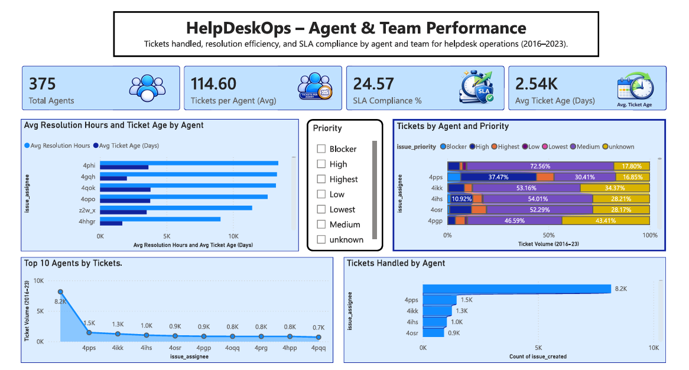

# 📊 HelpDeskOps – Helpdesk Operations Dashboard


---

## 📌 Project Overview

**HelpDeskOps** is an end-to-end **Power BI Operations Analytics Dashboard** that analyzes helpdesk ticket data from **2016–2023**.

The dashboard provides operational visibility into:

- 📈 Ticket demand
- 📂 Backlog management
- ⏱ SLA performance
- 👨‍💻 Agent productivity

It helps support managers identify operational bottlenecks, improve workload distribution, and monitor service performance through interactive dashboards.

---

# 🎯 Business Problem

Support organizations receive thousands of tickets every year.

Without proper analytics it becomes difficult to answer questions like:

- How many tickets are we handling?
- Which priorities create the largest backlog?
- Are we meeting SLA targets?
- Which agents are overloaded?
- Where are operational bottlenecks occurring?

This dashboard transforms raw ticket data into actionable operational insights.

---

# 📂 Dataset

The dashboard is built on an **Issues** dataset containing ticket-level information including:

- Ticket Created Date
- Status
- Priority
- Issue Type
- Assignee
- Resolution Information

**Analysis Period:** **2016 – 2023**

---

# 📊 Dashboard Pages

## 📍 Page 1 — Support Overview

### KPIs

- Total Ticket Volume
- Average Ticket Age
- Backlog Count
- SLA Compliance %

### Visuals

- Ticket Volume Trend
- Backlog by Priority
- Average Ticket Age by Issue Type

### Purpose

Provides an executive summary of helpdesk demand, backlog, ticket aging, and SLA performance.

---

## 📍 Page 2 — Workload & Backlog

### KPIs

- Open Tickets
- In Progress Tickets
- Waiting Tickets
- Backlog Tickets
- Closed Tickets

### Visuals

- Tickets by Status
- Backlog by Priority
- Monthly Ticket Creation
- Backlog by Issue Type

### Purpose

Shows where tickets are currently sitting in the support lifecycle and highlights backlog pressure.

---

## 📍 Page 3 — SLA & Resolution Performance

### KPIs

- Resolved Tickets
- SLA Compliance %
- Average Ticket Age
- SLA Breached Tickets

### Visuals

- SLA Compliance by Priority
- SLA Trend by Month
- Ticket Age by Issue Type
- SLA Breaches by Issue Type

### Purpose

Evaluates service-level performance and identifies major causes of SLA breaches.

---

## 📍 Page 4 — Agent & Team Performance

### KPIs

- Total Agents
- Average Tickets per Agent
- SLA Compliance
- Average Ticket Age

### Visuals

- Top 10 Agents
- Tickets by Agent & Priority
- Resolution Time by Agent
- Ticket Distribution

### Purpose

Analyzes workload distribution and identifies productivity differences across support agents.

---

# 📁 Repository Structure

```text
HelpDeskOps-Analysis/
│
├── Dashboard-images/
│   ├── Support Overview.png
│   ├── Workload & Backlog.png
│   ├── SLA & Resolution Performance.png
│   └── Agent and Team Performance.png
│
├── Datasets/
│
├── HelpdeskOps.pbix
├── HelpdeskOps_Analysis_Report.pdf
├── Measures.md
└── README.md
```

---

# 🚀 How to Use

1. Download **HelpdeskOps.pbix**
2. Open using **Power BI Desktop**
3. Refresh the data (if required)
4. Navigate across all dashboard pages
5. Use slicers to filter by:
   - Priority
   - Date
   - Issue Type
   - Agent

---

# 📏 KPI Definitions

| KPI | Description |
|------|-------------|
| Ticket Volume | Total number of tickets created |
| Backlog | Tickets not yet resolved or closed |
| Average Ticket Age | Average age of unresolved tickets |
| SLA Compliance | Percentage of tickets meeting SLA |
| SLA Breached | Tickets exceeding SLA |
| Tickets per Agent | Average workload handled by each agent |

---

# 📸 Dashboard Preview

## Executive Dashboard


---

## Workload & Backlog


---

## SLA & Resolution Performance


---

## Agent & Team Performance



---

# 💡 Key Insights

- 📈 Ticket volume peaks around **2016** and **2022** before declining in **2023**.
- 📂 Backlog is concentrated in **Medium** and **High** priority tickets.
- ⏱ Overall **SLA Compliance is approximately 24.6%**, indicating opportunities for operational improvement.
- ⚠ Ticket and Service issue types contribute the largest number of SLA breaches.
- 👥 Agent workload is unevenly distributed, with a small number of agents handling a significant share of tickets.

---

# 🎯 Business Recommendations

- Reduce backlog through regular aging reviews.
- Improve SLA monitoring by priority and issue type.
- Balance workload across support agents.
- Prioritize aging Medium and High priority tickets.
- Continuously monitor operational KPIs using the dashboard.

---

# 🛠 Tech Stack

- **Power BI**
- **Power Query**
- **DAX**
- **SQL**
- **Python (Data Preparation)**

---

# 👤 Author

**Smile Mangla**

B.Tech CSE (Data Science)

Power BI • SQL • Python • Data Analytics

---

⭐ If you found this project useful, consider giving the repository a star!