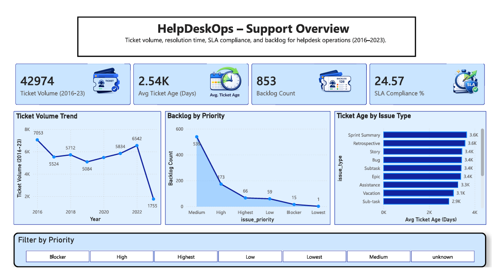
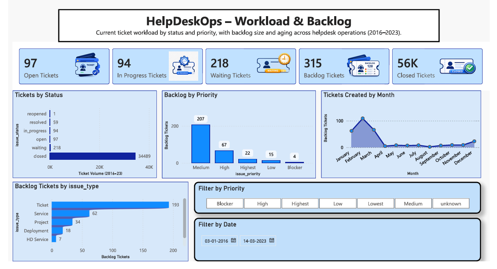
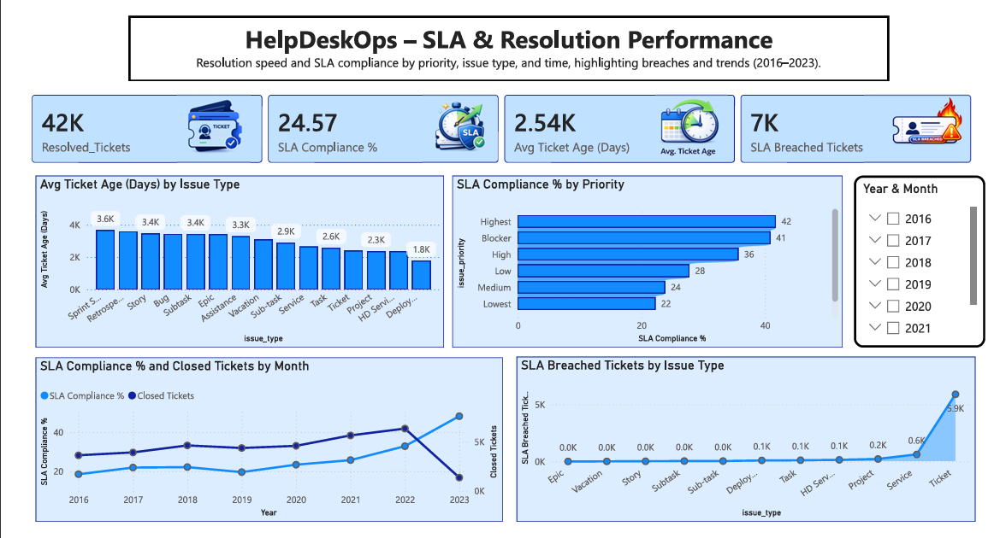

# HelpDeskOps – Helpdesk Operations Dashboard

HelpDeskOps is a Power BI dashboard that analyzes helpdesk ticket data from 2016–2023.  
It provides a four-page view across demand, backlog, SLA performance, and agent productivity so support leaders and analysts can quickly understand how the desk is performing.

---

## 1. What this dashboard does

This report answers core operational questions:

- How much ticket volume are we handling over time?
- Where is backlog building up (by priority and issue type)?
- Are we meeting our SLA commitments, and where are we breaching?
- How is workload and performance distributed across agents?

The dashboard is built on an `issues` dataset representing helpdesk tickets with fields such as created date, status, priority, type, and assignee.

---

## 2. Pages and visuals

### Page 1 – Support Overview

High-level summary of the helpdesk:

- **KPIs**
  - Ticket Volume (2016–23)
  - Avg Ticket Age (Days)
  - Backlog Count
  - SLA Compliance %
- **Visuals**
  - Ticket Volume Trend (by year)
  - Backlog by Priority
  - Ticket Age by Issue Type
- **Filters**
  - Priority

This page is the entry point for understanding overall demand, aging, backlog, and basic SLA performance. [347]

---

### Page 2 – Workload & Backlog

Operational workload and queue view:

- **KPIs**
  - Open Tickets
  - In Progress Tickets
  - Waiting Tickets
  - Backlog Tickets
  - Closed Tickets
- **Visuals**
  - Tickets by Status
  - Backlog by Priority
  - Tickets Created by Month
  - Backlog Tickets by Issue Type
- **Filters**
  - Priority
  - Date (2016–2023)

This page shows where tickets sit in the lifecycle and which priorities/types are driving backlog. [347]

---

### Page 3 – SLA & Resolution Performance

Service level and speed view:

- **KPIs**
  - Resolved Tickets
  - SLA Compliance %
  - Avg Ticket Age (Days)
  - SLA Breached Tickets
- **Visuals**
  - Avg Ticket Age (Days) by Issue Type
  - SLA Compliance % by Priority
  - SLA Compliance % and Closed Tickets by Month
  - SLA Breached Tickets by Issue Type
- **Filters**
  - Year & Month

This page highlights SLA adherence, breach patterns, and which issue types and priorities drive delays. [347]

---

### Page 4 – Agent & Team Performance

Agent productivity and workload distribution:

- **KPIs**
  - Total Agents
  - Tickets per Agent (Avg)
  - SLA Compliance %
  - Avg Ticket Age (Days)
- **Visuals**
  - Avg Resolution Hours and Ticket Age by Agent
  - Tickets by Agent and Priority
  - Top 10 Agents by Tickets
  - Tickets Handled by Agent
- **Filters**
  - Priority

This page identifies top contributors, workload imbalances, and potential process or training opportunities at the agent level. [347]

---

## 3. Files in this repository

Suggested structure:

```text
helpdeskops-dashboard/
├── HelpdeskOps_Dashboard_Final.pbix      # Power BI report
├── README.md                             # This file
├── HelpDeskOps_Report_Document.md        # Detailed report write-up (optional)
├── dax/                                  # DAX measures and logic (optional)
│   └── measures.md
├── data_sample/                          # Anonymized sample data (optional)
│   └── issues_sample.csv
└── screenshots/                          # Page screenshots
    ├── page1_support_overview.png
    ├── page2_workload_backlog.png
    ├── page3_sla_resolution.png
    └── page4_agent_team.png

---

## 4. How to use the dashboard

1. **Download** `HelpdeskOps_Dashboard_Final.pbix` from this repository.
2. **Open** it in Power BI Desktop (latest version recommended).
3. If connecting to your own data:
   - Map your ticket table to the `issues` model,
   - Ensure key fields exist (created date, status, priority, type, assignee).
4. Use the slicers (priority, date, issue type, agent) on each page to explore:
   - Overall ticket demand and backlog,
   - SLA violations and aging,
   - Agent-level workload and performance.

---

## 5. Data & metric notes

- Data is filtered from **2016-01-01** onward. 
- Where a true resolution timestamp is not available, **ticket age** is used as a proxy for resolution speed.
- Backlog is defined as tickets that are not in a final closed/resolved status.
- SLA metrics assume an underlying SLA flag/logic in the dataset (e.g., SLA met vs breached) and may need to be adapted for other environments.

---

## Dashboard Preview

### Executive Dashboard



### Workload Dashboard



### SLA Dashboard



### Agent Dashboard


## 6.Key insights from the current dataset include:

- Ticket volume peaks around 2016 and 2022, then declines in 2023. 
- Backlog is concentrated in Medium and High priority tickets, indicating sustained pressure on important work. - SLA compliance is relatively low (~24.6%), with a sizable number of SLA-breached tickets, especially for certain issue types.
 - Agent workload is uneven, with a small number of agents carrying a large portion of tickets. 

